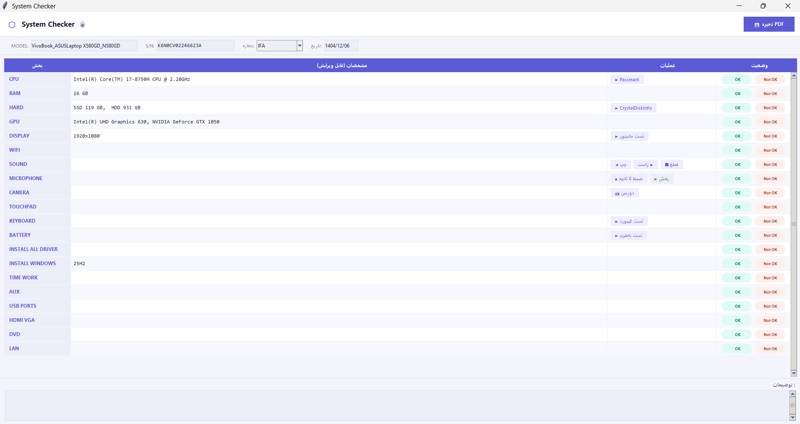

# ⬡ System Checker — چک لیست سیستم

<div align="center">


**ابزار حرفه‌ای چک‌لیست سیستم برای تعمیرکاران لپ‌تاپ و کامپیوتر**

A professional system checklist tool for laptop & PC technicians

</div>

---

## 📸 Screenshots

> برنامه با تم روشن زیبا و رابط کاربری مدرن



---

## ✨ Features / امکانات

| Feature | توضیح |
|---|---|
| 🔍 **Auto Detection** | تشخیص خودکار CPU, RAM, GPU, HDD/SSD, Display |
| 💾 **PDF Export** | خروجی PDF حرفه‌ای با طراحی زیبا |
| 🎵 **Sound Test** | تست بلندگو چپ و راست جداگانه |
| 🎤 **Mic Record** | ضبط ۵ ثانیه‌ای میکروفون با شمارش معکوس |
| 📷 **Camera** | باز کردن دوربین ویندوز |
| ✅ **OK / Not OK** | تاگل‌های رنگی برای وضعیت هر بخش |
| 🗓️ **Jalali Date** | پشتیبانی از تاریخ شمسی |
| 🏪 **Multi-Shop** | انتخاب نام مغازه در چک‌لیست |
| 🔒 **Admin Run** | اجرای ابزارها با دسترسی Administrator |

---

## 🖥️ Auto-Detected Hardware / سخت‌افزار تشخیص داده شده

- **CPU** — نام و مدل پردازنده
- **RAM** — حجم کل حافظه
- **HARD** — نوع (SSD / NVMe / HDD) + حجم دیسک‌ها
- **GPU** — کارت گرافیک
- **DISPLAY** — رزولوشن واقعی مانیتور (بدون تأثیر DPI Scaling)
- **INSTALL WINDOWS** — نسخه ویندوز نصب شده

---

## 📋 Checklist Items / آیتم‌های چک‌لیست

```
CPU  |  RAM  |  HARD  |  GPU  |  DISPLAY  |  WIFI
SOUND  |  MICROPHONE  |  CAMERA  |  TOUCHPAD  |  KEYBOARD
BATTERY  |  INSTALL ALL DRIVER  |  INSTALL WINDOWS
TIME WORK  |  AUX  |  USB PORTS  |  HDMI VGA  |  DVD  |  LAN
```

---

## 🚀 Getting Started

### Prerequisites / پیش‌نیازها

```bash
pip install wmi pywin32 jdatetime sounddevice numpy soundfile fpdf arabic-reshaper python-bidi opencv-python
```

### Run / اجرا

```bash
python system_checker.py
```

---

## 📦 Build EXE / ساخت فایل اجرایی

برای ساخت فایل `.exe` قابل حمل بدون نیاز به Python:

```bash
pip install pyinstaller

pyinstaller --noconsole --onedir --name SystemChecker \
  --hidden-import wmi \
  --hidden-import pythoncom \
  --hidden-import pywintypes \
  --hidden-import win32api \
  --hidden-import win32con \
  --hidden-import jdatetime \
  --hidden-import sounddevice \
  --hidden-import soundfile \
  --hidden-import numpy \
  --hidden-import arabic_reshaper \
  --hidden-import bidi \
  --hidden-import bidi.algorithm \
  --hidden-import fpdf \
  system_checker.py
```

بعد از build، پوشه `dist\SystemChecker\` ساخته می‌شه. فایل‌های زیر رو **دستی** کنارش کپی کن:

```
dist\SystemChecker\
├── SystemChecker.exe
├── Passmark\
│   └── PerformanceTestPortable.exe
├── CrystalDiskInfo.9.7.2.Portable\
│   └── CrystalDiskInfoPortable.exe
├── تست مانیتور.exe
├── تست کیبورد.exe
└── تست باطری.exe
```

---

## 🔧 Third-Party Tools / ابزارهای جانبی

این برنامه از ابزارهای زیر پشتیبانی می‌کند (باید جداگانه دانلود شوند):

| ابزار | لینک دانلود |
|---|---|
| **Passmark PerformanceTest** | [passmark.com](https://www.passmark.com/products/performancetest/) |
| **CrystalDiskInfo Portable** | [crystalmark.info](https://crystalmark.info/en/software/crystaldiskinfo/) |

---

## 📄 PDF Output / خروجی PDF

خروجی PDF شامل:
- نوار هدر رنگی با نام برنامه
- کارت‌های اطلاعاتی (تاریخ، مغازه، مدل، سریال)
- جدول کامل با رنگ‌بندی OK (سبز) و NOT OK (نارنجی)
- بخش توضیحات
- footer با تاریخ

---

## 🛠️ Tech Stack

- **Language:** Python 3.8+
- **GUI:** Tkinter
- **Hardware Info:** WMI (Windows Management Instrumentation)
- **PDF:** fpdf / fpdf2
- **Audio:** sounddevice + numpy
- **Persian Text:** arabic-reshaper + python-bidi
- **Date:** jdatetime (تاریخ شمسی)

---

## 📁 Project Structure

```
SystemChecker/
├── system_checker.py       # فایل اصلی برنامه
├── README.md
├── Passmark/               # Passmark Portable (جداگانه دانلود کنید)
├── CrystalDiskInfo.9.7.2.Portable/
├── تست مانیتور.exe
├── تست کیبورد.exe
└── تست باطری.exe
```

---

## 👤 Author

ساخته شده برای استفاده در مراکز تعمیر لپ‌تاپ و کامپیوتر

---

## 📝 License

This project is licensed under the MIT License.
